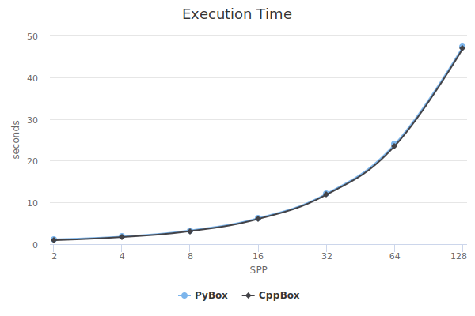

************
FBKSD Python 
************

.. contents:: Table of Contents
    :depth: 1
    :local:

Introduction
============

FBKSD v2.2.0 introduced python binds for the ``fbksd-client`` library.
This allows users to develop techniques (only non-adaptive denoisers, at this moment) in Python,
and leverage the increasingly popular machine learning frameworks.

This Python package is included with the `FBKSD system <https://github.com/fbksd/fbksd>`__.

Requirements
============

This package supports only Python 3.
To build it on Ubuntu 18.04, besides the dependencies for the main `FBKSD C++ library <https://github.com/fbksd/fbksd#dependencies>`_, you'll need the packages:

- libboost-python-dev
- libboost-numpy-dev
- python3-dev
- python3-numpy

Installation
============

To install the FBKSD Python package, you just have to enable it in the `main FBKSD library <https://github.com/fbksd/fbksd>`_.
Follow the FBKSD main library build/install `instructions <https://github.com/fbksd/fbksd#build-and-install>`_ and add the ``FBKSD_PYTHON`` variable when running cmake::

    $ cmake -DCMAKE_BUILD_TYPE=Release -DFBKSD_PYTHON=ON ../

By default, the package in installed under ``CMAKE_INSTALL_PREFIX/lib/python3/dist-packages``.
You can change this path using the ``FBKSD_PYTHON_PATH`` variable::

    $ cmake -DCMAKE_BUILD_TYPE=Release -DFBKSD_PYTHON=ON -DFBKSD_PYTHON_PATH=/usr/lib/python3.6../

The path passed to ``FBKSD_PYTHON_PATH`` is appended to the ``CMAKE_INSTALL_PREFIX`` value to form the final location.

.. Attention:: If the path passed to ``FBKSD_PYTHON_PATH`` doesn't start with a ``/``, cmake automatically prepends the current directory path to it.

Implementing a Denoising Technique
==================================

The :mod:`fbksd.client` module supports creating non-adaptive denoising techniques.

The workflow for is basically the same as in the `C++ API <https://fbksd.github.io/fbksd/docs/latest/>`__:

1. create a :class:`~fbksd.client.BenchmarkClient` object;
2. request information about the scene (:func:`~fbksd.client.BenchmarkClient.get_scene_info`);
3. setup the sample layout (:func:`~fbksd.client.BenchmarkClient.get_sample_layout`);
4. request the samples (:func:`~fbksd.client.BenchmarkClient.evaluate_samples`);
5. do your black magic to reconstruct the result image, saving it to the result image buffer;
6. send the result (:func:`~fbksd.client.BenchmarkClient.send_result`).

The example below shows a simple box filter.

.. code-block:: python
    :caption: File: PyBox

    #!/usr/bin/env python3

    import fbksd.client as fc
    import numpy as np

    result = None

    # step 5
    def process_samples(tile, offset):
        (ny, nx, ns, ss) = tile.shape
        (bx, by) = offset
        res_window = result[by:by+ny, bx:bx+nx]
        np.mean(tile, out=res_window, axis=2)

    # step 1
    client = fc.BenchmarkClient()

    # step 2
    info = client.get_scene_info()
    spp = info.get('max_spp')

    # step 3
    client.set_sample_layout(['COLOR_R', 'COLOR_G', 'COLOR_B'])
    result = client.get_result_buffer()

    # step 4
    client.evaluate_samples(spp, process_samples)

    # step 6
    client.send_result()

.. Note:: We included the shebang ``#!/usr/bin/env python3`` to allow the file to be executed directly.
    FBKSD doesn't know this is a python script, and will try to execute it like any other technique.

Running a Technique
===================

To execute it using the ``fbksd run`` command, add it to a workspace alongside a ``info.json`` file, `as usual <https://github.com/fbksd/fbksd#adding-denoisers>`__:

.. code-block:: json
    :caption: File: info.json

    {
        "short_name": "PyBox",
        "full_name": "A Python box filter example",
        "comment": "",
        "citation": ""
    }

.. Note::
    The ``"short_name"`` value, by default, should be the same as the executable name, that's why we didn't include a ``.py`` extension in our ``PyBox`` Python file.

Running a Technique Directly
----------------------------

As with the techniques implemented in C++, it's sometimes more convenient (for debugging, for example) to run the technique directly, without the ``fbksd run`` command.
The Python API also supports this feature, exactly `as in the C++ API <https://fbksd.github.io/fbksd/docs/latest/classfbksd_1_1BenchmarkClient.html#a79a0c280975d8e0b6ccc4d8a9d8512e4>`_::

    $ ./denoisers/pybox/PyBox --fbksd-renderer "./renderers/pbrt-v2/pbrt scenes/pbrt-v2/chess/chess.pbrt" --fbksd-spp 1

.. toctree::
    :hidden:
    :maxdepth: 2
    :caption: Modules

    client

Performance Considerations
==========================

When choosing python to developing a technique, you'd expect performance a loss when compared to a C++ implementation.
:numref:`my-figure` compares the execution times of a box filter implemented in C++ vs one implemented in Python. Being a very simple technique, you can see that the overhead is almost negligible. As the technique becomes more complex, you can expect the performance hit to become more noticeable.

.. _my-figure:

    Execution times of two implementations of a box filter, one using the FBKSD C++ API and the other using the Python version.

A good rule-of-thumb to keep in mind when developing your technique in Python is: avoid raw loops. Make an effort to use ``numpy`` functions and the like, which are well optimized. If you can't avoid writing that nasty loop, you can always try to move the critical parts to C/C++ using `ctypes <https://docs.python.org/3.6/library/ctypes.html>`_.

Indices and Tables
==================
* :ref:`genindex`
* :ref:`modindex`
